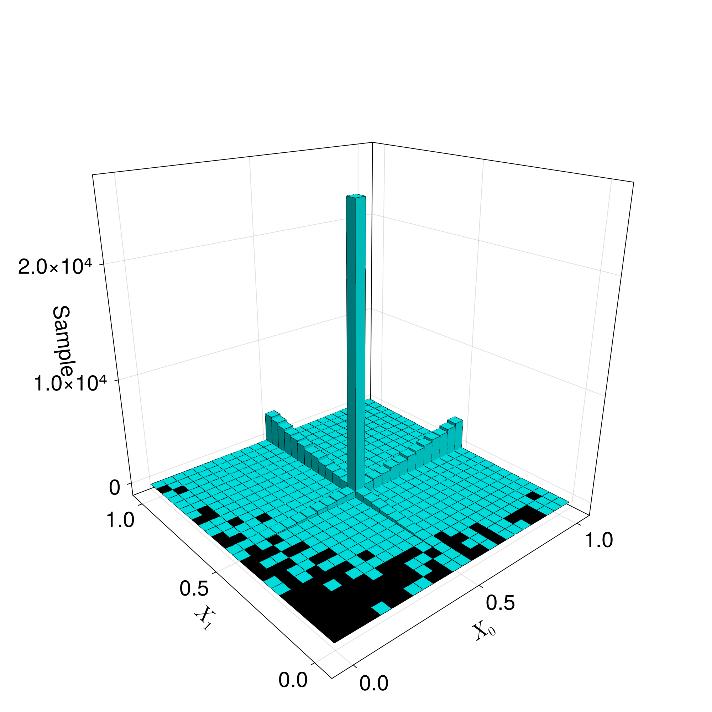

# Guide


--------------
# histogram3D function 
- x,y: array containing samples for each dimension
- n: number of bins for each dimension, n*n bins in total

# Example
```sh
f(x)=x[2]^2/ ((x[1]-0.5)^2+10^-10)+x[1]^2/ ((x[2]-0.5)^2+10^-10)
global v = vegas(f, zeros(2), fill(1.0, 2),ncalls = 100000,nbins=1000, maxiter =20)
 println("----------------------------------")
println(v.integral_estimate)
println(v.standard_deviation)
println(v.chi_squared_average)
global n = 100  
global sample1 = generate_random_between_intervals(v.adaptive_grid[:,1], n)
global sample2 = generate_random_between_intervals(v.adaptive_grid[:,2], n)
n=25
global A=histogram_or_bars_in_3d((sample1),(sample2),n)
display(A)
```


The above code uses the Vegas algorithm to estimate the integral. The code returns a Struct containing the adaptive Vegas map(grid).
Initialize random samples based on these grids.
I use the histogram3D function to check if the distribution of the samples matches the shape of the function.

Note: Samples must be normalized in the range [0;1]

Vegas code is taken from https://github.com/ranjanan/MonteCarloIntegration.jl/blob/master/src/vegas.jl#L230

